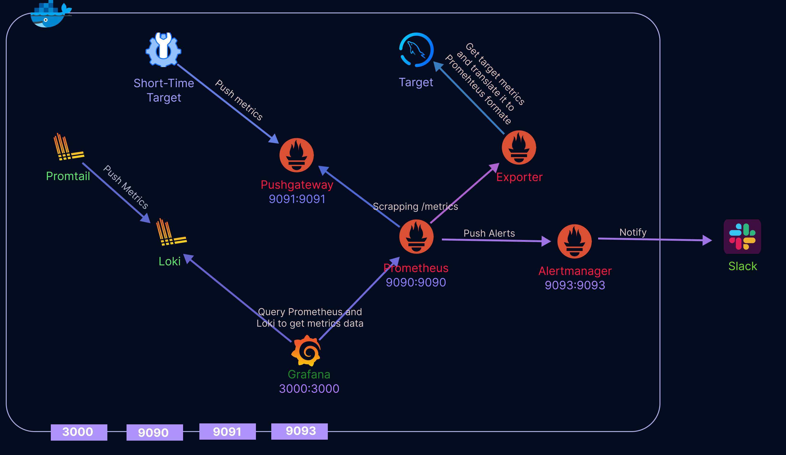

<div align="center">  


 
  

Deploy the Prometheus Stack (Prometheus, Grafana, Loki) on Docker using `docker compose`.

  

</div>  

---

## 🚀 Quick Start  

1️⃣ **Clone the repo**  
```bash
git clone https://github.com/AhmedMattar21/watchdog.git
cd watchdog
```  

2️⃣ **Run the stack**  
```bash
docker compose up -d --force-recreate
```  

3️⃣ **Start the targets**  
```sh
cd targets
docker compose up -d
```  

4️⃣ **Verify running containers**  
```bash
docker ps
```  

## 🔗 Access  

- **Prometheus:** `http://localhost:9090`  
- **Grafana:** `http://localhost:3000` (Login: `admin / watchdog`)  
- **Alertmanager & Pushgateway:** Replace the port accordingly  

## 📊 Grafana Dashboards  

- **MySQL Dashboard** (Runs without extra config)  
- **Nodes Dashboard** (Edit `prometheus.yml` to add node targets)  
- **Docker-Engine & Node Dashboard** (*In Progress*)  

## 🖥️ External Targets
🛠 **Edit `prometheus.yml` to add external targets:**  
```sh
nano ./prometheus/prometheus.yml 
```  
```yaml
  - job_name: "Nodes"
    static_configs:
      - targets: ["192.168.1.8:9100","192.168.1.208:9100"]
```  
🔄 **Apply changes:**  
```sh
docker compose up -d --force-recreate
```  

## 🔔 Slack Alerts  

📌 **Configure Slack notifications in `alertmanager.yml`**  
```sh
nano alertmanager/alertmanager.yml
```  
Replace `SLACK_CHANNEL` & `SLACK_URL`:  
```yaml
receivers:
- name: slack-notifications
  slack_configs:
  - channel: "#SLACK_CHANNEL"
    send_resolved: true
    api_url: "SLACK_URL"
    title: "{{ .GroupLabels.alertname }}"
    text: "{{ range .Alerts }}{{ .Annotations.summary }}\n{{ .Annotations.description }}\n{{ end }}"
```  

---
